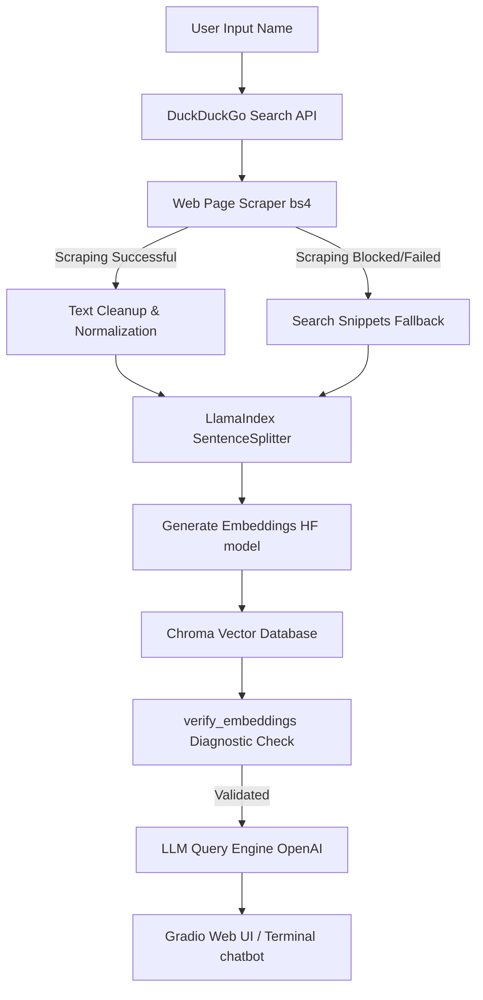

# 🤖 LinkedIn Icebreaker Bot

An AI-powered Retrieval-Augmented Generation (RAG) application that scrapes the web for a person's professional profile, indexes the content into a local vector database, extracts key facts, and provides a stateful interactive chat interface to answer questions about their career, projects, and education.

---

## 🏗️ Architecture & Data Flow

The project is designed with a modular structure that separates scraping, database ingestion, querying, and user interfaces:



---

## ✨ Key Features & Technical Highlights

* **Multi-User State Management**: Utilizes `gr.State` and `UUID4` session tracking to isolate indexing states, allowing multiple users to query different profiles concurrently without cross-contaminating vector stores.
* **Fail-Safe Web Scraping**: Features an automated fallback system. If direct page scraping is rate-limited or blocked by anti-scraping measures, the app automatically extracts details from high-quality DuckDuckGo snippets.
* **Proactive Vector Diagnostics**: Implements a `verify_embeddings` helper that directly queries the underlying ChromaDB database to verify that vector embeddings exist for all chunks before initializing queries, adhering to the fail-fast principle.
* **Modular Clean Architecture**: Organized with strict separation of concerns:
  * `data_extraction.py`: Web searching and parsing.
  * `data_processing.py`: Splitting text, embedding, and vector database management.
  * `query_engine.py`: Prompts templates and retrieval-augmented LLM orchestration.
  * `config.py`: Parameter settings, model designations, and prompt definitions.

---

## 🛠️ Setup & Installation

### 1. Prerequisites
Ensure you have Python 3.10+ installed.

### 2. Install Dependencies
Clone the repository and install the required Python libraries:
```bash
pip install -r requirements.txt
```

*(Requirements include: `llama-index`, `llama-index-vector-stores-chroma`, `llama-index-embeddings-huggingface`, `requests`, `beautifulsoup4`, `langchain-community`, `gradio`, `python-dotenv`)*

### 3. Environment Configuration
Create a `.env` file in the root folder of the project:
```env
OPENAI_API_KEY=your_openai_api_key_here
```

---

## 🚀 How to Run the App

You can interact with the system via the command-line interface or the web GUI.

### Option A: Web User Interface (Gradio)
Run the web application server:
```bash
python app.py
```
Then open `http://127.0.0.1:5000` in your web browser. 

1. Go to the **1. Process Profile** tab, input a name (e.g., *"Cristiano Ronaldo"*), and click **Analyze & Index**.
2. Once the 3 facts are successfully generated, go to the **2. Interactive Chat** tab to ask specific questions about the person.

### Option B: Terminal Command Line
Run the terminal interactive loop:
```bash
python main.py
```
Follow the prompts in the terminal to enter a name, generate facts, and start querying details directly in the CLI.
